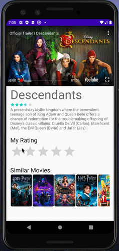

# Project 2 - *Flixster*

**Flixster** shows the latest movies currently playing in theaters. The app utilizes the Movie Database API to display images and basic information about these movies to the user.

Time spent: **16** hours spent in total

## User Stories

The following **required** functionality is completed:

* [x] User can **scroll through current movies** from the Movie Database API
* [x] Display a nice default [placeholder graphic](https://guides.codepath.org/android/Displaying-Images-with-the-Glide-Library#advanced-usage) for each image during loading
* [x] For each movie displayed, user can see the following details:
  * [x] Title, Poster Image, Overview (Portrait mode)
  * [x] Title, Backdrop Image, Overview (Landscape mode)
* [x] Allow user to view details of the movie including ratings and popularity within a separate activity

The following **stretch** features are implemented:

* [ ] Improved the user interface by experimenting with styling and coloring.
* [x] Apply rounded corners for the poster or background images using [Glide transformations](https://guides.codepath.org/android/Displaying-Images-with-the-Glide-Library#transformations)
* [ ] Apply the popular [View Binding annotation library](http://guides.codepath.org/android/Reducing-View-Boilerplate-with-ViewBinding) to reduce boilerplate code.
* [x] Allow video trailers to be played in full-screen using the YouTubePlayerView from the details screen.

The following **additional** features are implemented:

* [x] Allow users to see and select similar movies in the details view.
* [x] Apply scrollability on the details view, in case the content overflows the screen view.
* [x] Let users make ratings directly to the database.

## Video Walkthrough

Here's a walkthrough of implemented user stories:

This rating bar is connected to the user's TMDb account, so any changes in the app are reflected in the database as well.
Ratings can either be added (like Descendants), or updated (like Onward).

## Notes

I'm not entirely sure if I executed the YouTube player the way I was supposed to. I don't know if the video was supposed to play automatically, or if it
should force the player into fullscreen mode, but I hope what I did was okay. Also, I noticed that a "trailers" endpoint existed, so I hope it's okay that I
used that instead of the "movies" endpoint. The trailers endpoint was organized by the video platform, so it was easy to garauntee that I was using a YouTube
video.

And after writing this I realize that I really should've just asked, but I didn't and know I know what I should do for the next project!

## Open-source libraries used

- [Android Async HTTP](https://github.com/loopj/android-async-http) - Simple asynchronous HTTP requests with JSON parsing
- [Glide](https://github.com/bumptech/glide) - Image loading and caching library for Android

## License

    Copyright [2020] [FBU - Codepath]

    Licensed under the Apache License, Version 2.0 (the "License");
    you may not use this file except in compliance with the License.
    You may obtain a copy of the License at

        http://www.apache.org/licenses/LICENSE-2.0

    Unless required by applicable law or agreed to in writing, software
    distributed under the License is distributed on an "AS IS" BASIS,
    WITHOUT WARRANTIES OR CONDITIONS OF ANY KIND, either express or implied.
    See the License for the specific language governing permissions and
    limitations under the License.
